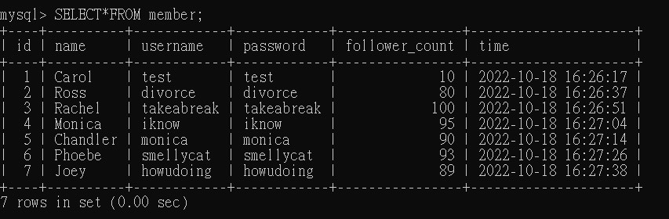

# **Assignment Week5**

## 要求二 : 建立資料庫和資料表

- 建立一個新的資料庫，取名字為 website。

  - SQL 指令  
    SHOW DATABASES;  
    CREATE DATABASE website;  
    USE website;

- 在資料庫中，建立會員資料表，取名字為 member。

  - SQL 指令  
    CREATE TABLE member(  
    id BIGINT PRIMARY KEY AUTO_INCREMENT,  
    name VARCHAR(255) NOT NULL,  
    username VARCHAR(255) NOT NULL,  
    password VARCHAR(255) NOT NULL,  
    follower_count INT UNSIGNED NOT NULL DEFAULT 0,  
    time DATETIME NOT NULL DEFAULT CURRENT_TIMESTAMP);

---

## 要求三 : SQL CRUD

- 使⽤ INSERT 指令新增⼀筆資料到 member 資料表中，這筆資料的 username 和 password 欄位必須是 test。接著繼續新增⾄少 4 筆隨意的資料。

  - SQL 指令  
    INSERT INTO member(name,username,password,follower_count)VALUES('Carol','test','test',10);  
    INSERT INTO member(name,username,password,follower_count)VALUES('Ross','divorce','divorce',80);  
    INSERT INTO member(name,username,password,follower_count)VALUES('Rachel','takeabreak','takeabreak',100);  
    INSERT INTO member(name,username,password,follower_count)VALUES('Monica','iknow','iknow',95);  
    INSERT INTO member(name,username,password,follower_count)VALUES('Chandler','monica','monica',90);  
    INSERT INTO member(name,username,password,follower_count)VALUES('Phoebe','smellycat','smellycat',93);  
    INSERT INTO member(name,username,password,follower_count)VALUES('Joey','howudoing','howudoing',89);
  - Command Line 介面  
    

- 使⽤ SELECT 指令取得所有在 member 資料表中的會員資料。

  - SQL 指令  
    SELECT\*FROM member;
  - Command Line 介面  
    

- 使⽤ SELECT 指令取得所有在 member 資料表中的會員資料，並按照 time 欄位，由近到遠排序。

  - SQL 指令  
    SELECT\*FROM member ORDER BY time DESC;
  - Command Line 介面  
    

- 使⽤ SELECT 指令取得 member 資料表中第 2 ~ 4 共三筆資料，並按照 time 欄位，由近到遠排序。( 並非編號 2、3、4 的資料，⽽是排序後的第 2 ~ 4 筆資料 )

  - SQL 指令  
    SELECT\*FROM member ORDER BY time DESC LIMIT 1,3;
  - Command Line 介面  
    

- 使⽤ SELECT 指令取得欄位 username 是 test 的會員資料。

  - SQL 指令  
    SELECT\*FROM member WHERE usernsme='tset';
  - Command Line 介面  
    

- 使⽤ SELECT 指令取得欄位 username 是 test、且欄位 password 也是 test 的資料。

  - SQL 指令  
    SELECT\*FROM member WHERE username='tset' and password='test';
  - Command Line 介面  
    

- 使⽤ UPDATE 指令更新欄位 username 是 test 的會員資料，將資料中的 name 欄位改。

  - SQL 指令  
    UPDATE member SET name='test2' WHERE username='test';
  - Command Line 介面  
    

---

## 要求四 : SQL Aggregate Functions

- 取得 member 資料表中，總共有幾筆資料 ( 幾位會員 )。

  - SQL 指令  
    SELECT COUNT(id) FROM member;
  - Command Line 介面  
    Member.jpg> "Count(id)Member")

- 取得 member 資料表中，所有會員 follower_count 欄位的總和。

  - SQL 指令  
    SELECT SUM(follower_count) FROM member;
  - Command Line 介面  
    Member.jpg> "Sum(follower_count)Member")

- 取得 member 資料表中，所有會員 follower_count 欄位的平均數。

  - SQL 指令  
    SELECT AVG(follower_count) FROM member;
  - Command Line 介面  
    Member.jpg> "Avg(follower_count)Member")

---

## 要求五 : SQL JOIN (Optional)

- 在資料庫中，建立新資料表紀錄留⾔資訊，取名字為 message。

  - SQL 指令  
    CREATE TABLE message(  
    id BIGINT PRIMARY KEY AUTO_INCREMENT,  
    member_id BIGINT NOT NULL,  
    content VARCHAR(255) NOT NULL,  
    like_count INT UNSIGNED NOT NULL DEFAULT 0,  
    time DATETIME NOT NULL DEFAULT CURRENT_TIMESTAMP);

    INSERT INTO message(member_id,content,like_count)VALUE(5,'Hi, I’m Chandler. I make jokes when I’m uncomfortable.',62);  
    INSERT INTO message(member_id,content,like_count)VALUE(2,'You’re over me? When were you… under me?',87);  
    INSERT INTO message(member_id,content,like_count)VALUE(6,'I wish I could, but I don’t want to.',92);  
    INSERT INTO message(member_id,content,like_count)VALUE(5,'It’s so hard to care when you’re this relaxed.',95);  
    INSERT INTO message(member_id,content,like_count)VALUE(1,'Hello! I’m test.',10);  
    INSERT INTO message(member_id,content,like_count)VALUE(1,'test! test! test!.',11);  
    INSERT INTO message(member_id,content,like_count)VALUE(1,'This is test.',5);  
    INSERT INTO message(member_id,content,like_count)VALUE(1,'WOW',22);

    ALTER TABLE message ADD FOREIGN KEY(member_id)REFERENCES member(id);

  - Command Line 介面  
    

- 使⽤ SELECT 搭配 JOIN 語法，取得所有留⾔，結果須包含留⾔者會員的姓名。

  - SQL 指令  
    SELECT message.id, member.name, message.content, message.like_count, message.time FROM message INNER JOIN member ON message.member_id=member.id;
  - Command Line 介面  
    

- 使⽤ SELECT 搭配 JOIN 語法，取得 member 資料表中欄位 username 是 test 的所有留⾔，資料中須包含留⾔者會員的姓名。

  - SQL 指令  
    SELECT message.id, member.name, message.content, message.like_count, message.time FROM message INNER JOIN member ON message.member_id=member.id WHERE member.username='test';
  - Command Line 介面  
    

- 使⽤ SELECT、SQL Aggregate Functions 搭配 JOIN 語法，取得 member 資料表中欄位 username 是 test 的所有留⾔平均按讚數。

  - SQL 指令  
    SELECT AVG(message.like_count) FROM message INNER JOIN member ON member.id=message.member_id WHERE member.username='test';
  - Command Line 介面  
    .jpg> "Username='test'AVG(like_count)")
